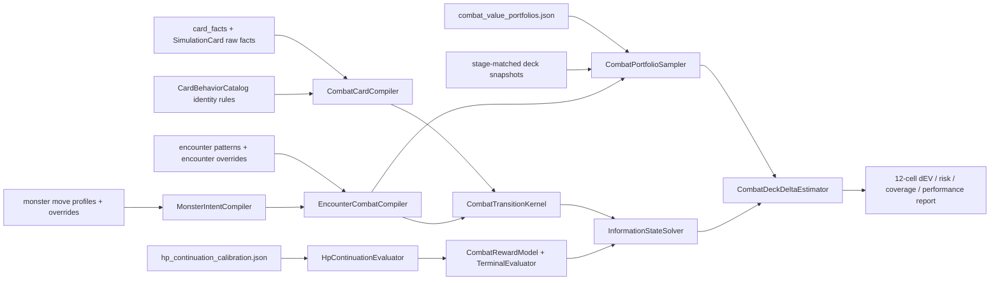

# Phase 1 实装蓝图：Combat-aware 信息状态模拟器与十二格战斗组合

状态：已获用户确认并完成 A-G 离线实现；训练/runtime gate 为 No-Go。实测与缺口见
`combat-information-state-phase1-review.md`。

关联设计：`docs/modeling/information-state-simulator-phase1-plan.md`

## 1. 本轮要交付什么

确认后实施一个与旧求解器并行、但不依赖旧求解语义的离线 Phase 1：

1. 真实玩家/怪物 HP、格挡、死亡、目标和 A10 怪物意图。
2. 只基于玩家可见信息决策的 AND/OR information-state solver。
3. `1 点实际敌人 HP 损失 = 1 价值`，防御价值只来自实际避免的 HP 损失。
4. Act 1/2/3 x Weak/Normal/Elite/Boss 十二格 portfolio。
5. 4/8/12 回合分别规划的 paired deck-level dEV。
6. 独立 review JSON/Markdown、覆盖率、风险和性能报告。

Phase 1 明确不做：

- 不修改 `CardValueOverlay/data/card_values.json`。
- 不让新结果进入游戏 overlay。
- 不在 `DeckMonteCarloSimulator` 中逐段加怪物分支。
- 不用旧 `IntrinsicValue`、`DamageValue`、`BlockValuePerBlock` 或
  `blockToDamage` 给新战斗结算定价。
- 不用未知概率的均匀分支、平均攻击或零价值代替 unsupported 机制。
- 不以胜利样本的平均掉血直接生成 HP 单价。

Phase 1 完成后有第二个明确 gate：只有十二格覆盖、正确性、CI 和性能全部达标，
并且用户批准 HP calibration 与 primary 权重后，才迁移 `train-card-values`；游戏内
实时 dEV 是更后面的独立 gate。

## 2. 代码边界与总调用关系

新代码使用 durable namespace `CardValueOverlay.Modeling.Combat`，不使用永久性的
`V2` 命名。数据流如下：



### 2.1 为什么不直接改旧求解器

旧文件 `CardValueOverlay.Modeling/Simulation/DeckMonteCarloSimulator.cs` 同时承担：

- Monte Carlo run orchestration；
- 隐藏牌序状态；
- 强制出牌策略和 Top-B 搜索；
- 卡牌动作、生成、变换、card-object preview；
- 静态/动态卡值、source credit 和 future continuation；
- 多种诊断与运行时快速路径。

继续在以下方法内加入怪物 HP/intent 会让旧价值规则和新物理规则同时存在：

| 旧方法 | 当前责任 | Phase 1 的替代责任 |
| --- | --- | --- |
| `PlayTurn` / `Search` | 回合和递归选择 | `InformationStateSolver.SolveDecision` |
| `SearchOrdinaryCandidates` / `SelectTopPlayableCards` | Top-B 剪枝 | exact legal actions；不做启发式预删 |
| `ApplyForcedPlayPolicy` | 强制零费牌/Power | 不保留；所有合法牌是一等 action |
| `PlayCard` | 卡牌执行并启动嵌套 preview | `CombatTransitionKernel.BeginAction` |
| `PlayValue` | 把物理效果换成静态 EV | `CombatRewardModel.Score` |
| `HpLossPenaltyValue` | 固定自伤罚分 | `HpContinuationEvaluator.Delta` |
| `VulnerableBonus` | 伤害价值增量 | `CombatDamageResolver` 的实际伤害 |
| `BuildValueCredits` | source attribution | `CombatRewardLedger`，仅诊断 |
| `FiniteHorizonLeafDecisionValue` | 旧 leaf 估值 | `CombatTerminalEvaluator` |
| `EstimatePersistentContinuationValue` / `BuildFutureTurnOpportunityProfile` | 均值场 tail | non-clairvoyant reference tail |
| `ComputeSearchStateFingerprint` | 旧 loop/cache key | `CombatStateEncoder` + exact memo |

Phase 1 不调用这些旧方法，也不在它们内部加 `if (combatAware)`。旧系统仅因现有
命令和游戏内实时 dEV 仍在使用而暂时保留；后续 cutover 按第 11 节删除替代路径。

### 2.2 离线代码不能意外打进游戏 DLL

当前 `CardValueOverlay.csproj` 会通过通配符把整个
`CardValueOverlay.Modeling/**/*.cs` 编译进 runtime DLL。若直接新增 Combat 文件，
离线 portfolio loader、报告器和大 memo 会自动进入游戏包。

Phase 1 必须修改 `CardValueOverlay.csproj` 中显式 Modeling include 的 `Exclude`，
排除：

```text
CardValueOverlay.Modeling/Combat/**/*.cs
```

`CardValueOverlay.Modeling.csproj`、Modeling tests 和 Tools 仍正常编译这些文件。
未来若要替换实时 dEV，应把经过验证的 I/O-free kernel/solver 提取到明确的 runtime
边界，而不是删除这个 exclude 后把 portfolio/reporting 一并打包。

## 3. 配置、数据和数学契约

### 3.1 十二格 portfolio

新建 `data/manual-tags/combat_value_portfolios.json`，schema v1。每个 portfolio
显式列出十二格，不能由 act/tier 默认组合悄悄补齐。

每格至少包含：

```text
id
actNumber
encounterTier                  Weak | Normal | Elite | Boss
hpContextId
encounterSelector
deckSource.path
deckSource.groups
startHpSource
proposalAllocationWeight
targetAggregationWeight
targetWeightSource
minimumUniqueEncounters
notes
```

预算表不在两处复制。`combat_value_portfolios.json` 只引用 `hpContextId`；对应的
`acceptableLossBudget` 保存在 HP calibration 文件中：

| Context | Act 1 | Act 2 | Act 3 |
| --- | ---: | ---: | ---: |
| Weak | 0 | 5 | 10 |
| Normal | 8 | 10 | 15 |
| Elite | 15 | 20 | 30 |
| Boss | 30 | 40 | 40 |

`proposalAllocationWeight` 只决定算力；`targetAggregationWeight` 才进入 primary
dEV。validator 要求 target 权重和为 1。若 target 权重仍是 prior，portfolio
只能标记为 `research`，不能标记为 `runtimeCandidate`。

### 3.2 HP continuation

新建 `data/manual-tags/hp_continuation_calibration.json`，schema v1。每个 context
至少包含：

```text
id
actNumber
encounterTier
acceptableLossBudget
futureReserveHp
method                         budgetKneeV1 | empiricalKnotsV1
safeMarginalValue
excessLossCurvature
empiricalKnots
source
sampleScope
confidence                     prior | provisional | empirical
generatedAt
```

`budgetKneeV1` 对单个样本按以下方式构造：

```text
Beffective = min(B, max(0, H0 - Hreserve))
Hknee      = H0 - Beffective
loss       = max(0, H0 - H)
cost(loss) = lambda_safe * loss
           + kappa * max(0, loss - Beffective)^2
```

并令 `Phi(H) - Phi(H0) = -cost`。治疗到 `H > H0` 使用安全区边际并受 max HP
截断。`Phi(0)` 还要受 `CombatValueBounds` 生成的死亡支配界约束。

关键不变量：

- `Phi` 单调递增。
- 低 HP 的边际价值不低于高 HP。
- budget 内仍有非负 HP 成本。
- 没有任何“掉血未满 budget 加分”的逻辑。
- `lambda_safe` 和 `kappa` 必须有数据来源或明确标为 prior。

### 3.3 轨迹回报

每次物理转移返回 `CombatRewardDelta`：

```text
offense = actualEnemyHpLost - actualEnemyHpRestored
hp      = Phi(playerHpAfter) - Phi(playerHpBefore)
reward  = offense + hp
```

敌人格挡损失、玩家获得格挡、overkill 和 unused block 只进 ledger，不直接进
reward。由于 enemy HP 与 player HP 的差分可 telescoping，同一物理终态不会因
攻击拆成多段而重复得分；ledger 不进入 memo key。

在 horizon 末：

- 胜利：不加任意 victory bonus。
- 死亡：应用动态 death-dominance bound。
- 未完成：固定 reference policy 继续结算未来玩家 HP/死亡风险，但不再奖励
  horizon 后必然造成的敌人伤害，避免抵消 4/8/12 内的伤害节奏。

### 3.4 怪物数据的严格边界

当前 `MonsterMoveStateEntry.FollowUpStateIds` 只保留目标列表，没有概率和条件。
因此：

- 只有一个 follow-up：可编译为确定性转移。
- 多个 follow-up：必须由源码可证的概率/条件或 manual override 补足。
- 没有 follow-up：只有 override 明确说明 self-loop/terminal/phase transition 时
  才支持。
- conditional monster slot 没有选择概率时同样 unsupported。

新建 `data/manual-tags/combat_encounter_overrides.json` 保存 encounter 选择概率、
slot 初态和阶段入口；现有 `encounter_damage_matrix_overrides.json` 继续只服务矩阵
报告，不复用为模拟真值。现有 `monster_move_overrides.json` 升级 schema，保存
move effect、A10 数值和 transition correction。所有 override 必须带 source、
reason 和 confidence。

## 4. 现有文件的具体修改

### 4.1 `CardValueOverlay.csproj`

修改点：显式 `Compile Include="CardValueOverlay.Modeling\**\*.cs"`。

逻辑：在 `Exclude` 中加入 `CardValueOverlay.Modeling\Combat\**\*.cs`。同时确认
Combat 配置没有进入 `RuntimeModelingResource`。这是 Phase 1 的打包安全门，不改变
现有 runtime simulator。

验证：`dotnet build CardValueOverlay.csproj --no-restore -v minimal` 后检查编译项或
发布 DLL，不应包含 `CombatPortfolioLoader`/`CombatReportWriter` 类型。

### 4.2 `CardValueOverlay.Modeling/Extraction/MonsterMoveParser.cs`

修改方法：

- `ParseMethodEffects`
- 对应 parser tests

当前方法先收集全部 attack，再收集 block，再收集 power，会丢失源码执行顺序。
改为收集 `(sourceIndex, MonsterMoveEffectTerm)`，按源码 index 排序后输出。不得用
effect kind 排序。`AddIntentFallbackEffects` 只在没有相应真实 effect 时补充。

`ParseFollowUps` 暂不猜概率；现有多目标结果交给新 compiler 严格拒绝或 override。

影响：`EnemyExpectationEstimator` 和 matrix 脚本仍能读取同一 JSON 字段；列表顺序
更接近游戏执行顺序。重新生成 monster profiles 后要重跑现有 monster parser
测试和 matrix 生成的 strict validation。

### 4.3 `CardValueOverlay.Tools/Program.cs`

修改方法：

- `Main` command switch
- `PrintHelp`

新增四个独立命令：

```text
validate-combat-portfolio
replay-monster-intents
benchmark-information-state-solver
estimate-combat-aware-deck-delta
```

这里只做分派和 help，不把加载/求解逻辑继续塞入 `Program.cs`。

### 4.4 `CardValueOverlay.Modeling.Tests/Program.cs`

修改 `Main`：在现有 extraction/simulation tests 之后、真实 extraction test 之前
调用：

```text
CombatPhase1TestSuite.RunAll()
```

不移动或改写用户当前的大量 legacy tests。新 suite 在独立文件中维护自己的
assert helper。

### 4.5 数据说明和手工输入

修改：

- `data/README.md`：登记三个新 durable 配置及 generated 输出位置。
- `data/manual-tags/monster_move_overrides.json`：schema 升级并保持空 override 也可
  通过 validator。

新建：

- `data/manual-tags/combat_value_portfolios.json`
- `data/manual-tags/hp_continuation_calibration.json`
- `data/manual-tags/combat_encounter_overrides.json`

第一轮只提交带 `prior`/`research` 标记的配置；正式 empirical 参数必须经过后续
review，不在实现时顺手猜值。

### 4.6 Phase 1 明确不修改的现有文件

| 文件/方法 | 原因 |
| --- | --- |
| `DeckMonteCarloSimulator.cs` 全部方法 | 防止新旧物理和价值语义混合 |
| `DeckSimulationOptions.cs` | 新 solver 使用独立 options，不继承旧 branch/depth 参数 |
| `SimulationScenarioRunner.Run` / `RunPureEvBenchmark` | 新建 combat runner；旧 scenario 行为保持稳定 |
| `SimulationScenario.ApplyPatch` / `CalculateIntrinsicValue` | 仍属旧静态 EV；新 card compiler 不读取结果值 |
| `SimulationCardLibraryBuilder.BuildCard` | Phase 1 复用其 raw facts；不改变旧命令结果 |
| `Program.TrainingValues.EstimateCandidateForm` | 等 Phase 1 go/no-go 后再迁移 |
| `Program.TrainingValues.BuildTrainingOptions` | 仍服务 legacy callers |
| `RealtimeEvService.EnsureSamples` / `BuildOptions` | 游戏实时切换是独立 gate |
| `CardValueOverlay/data/card_values.json` | Phase 1 禁止安装 |

若 compiler 发现某张 Phase 1 卡必须依赖身份规则，只在
`CardBehaviorCatalog` 中增加 declarative definition；不得在 kernel 中新写
`TypeName == ...`。这种增量要逐张列在实现 diff 中。

## 5. 新建 Modeling 文件与方法级责任

所有以下文件位于 `CardValueOverlay.Modeling/Combat/`，保持纯 C#，不引用 Godot
或 StS2 assembly。

### 5.1 Contracts 与状态

#### `CombatSimulationOptions.cs`

主要成员：

- `CombatSimulationOptions.Validate()`：检查 turns、chance mode、state budget、
  tail turns 和 seed；正式模式禁止隐式 fallback。
- `CombatSolverLimits`：`MaxCanonicalStates`、`MaxChanceBranches`、
  `ExactOutcomeLimit`、`SparseOutcomesPerChance`。
- `CombatSolverMode`：`Exact` 或 `SparseChance`。`Exact` 超限返回明确状态，
  不自动变成 greedy。

与旧 `DeckSimulationOptions` 无继承、无转换，防止旧的 branch width、forced play、
static state value 混入。

#### `CombatState.cs`

类型：

- `PlayerCombatState`
- `MonsterCombatState`
- `CombatCardInstanceState`
- `CombatWorldState`
- `CombatInformationState`
- `PendingCombatContinuation`

逻辑：

- World state 可持有真实隐藏牌序和已采样随机事实，仅供 policy evaluation。
- Information state 只含 hand、known ordered top、unknown multiset、公开 piles、
  资源、计数器、玩家/怪物公开状态和 intent belief。
- instance id 只有在卡牌有 instance-local mutable state 时进入 canonical 语义；
  普通同型牌按 signature 合并。
- `PendingCombatContinuation` 保存一张牌执行到哪个 effect，保证 draw/generation
  产生 chance node 后能继续剩余 effect，而不是 effect 内递归调用 solver。

#### `CombatStateFactory.cs`

方法：

- `CreateWorldState(CombatSample, CompiledCombatDeck, CompiledEncounter)`
- `CreateInformationState(CombatWorldState)`
- `CreateInformationStateFromScenario(CombatScenarioDefinition)`
- `ValidateInitialState(...)`

检查 HP/block 非负、怪物 stable id 唯一、visible intent 存在、牌实例只在一个
zone 中。初始怪物 HP 范围的实际值由 sample 先抽取，再作为可见 HP 给 planner。

#### `CombatAction.cs`

类型：

- `CombatAction`：`PlayCard`、`ChooseTarget`、`ChooseCardObject`、
  `ChooseGeneratedCard`、`SkipChoice`、`EndTurn`。
- `CombatOutcome`：`DrawCard`、`GeneratedChoiceSet`、`TransformResult`、
  `MonsterTransition`。
- `CombatActionKey` / `CombatOutcomeBranch`。

action key 使用稳定语义身份，不用当前 list index。所有概率用 double，并在
validator 中检查非负、有限、总和为 1（容差仅处理浮点求和）。

#### `CombatMutationJournal.cs`

方法：

- `Mark()`
- `SetScalar(...)`
- `MoveCard(...)`
- `AddStatus(...)`
- `ReplaceMonsterState(...)`
- `UndoTo(mark)`

solver 每个 branch 使用同一个 root state + journal。热路径不调用旧
`SimulationState.Clone`，也不复制四个完整牌堆。debug build 提供
`AssertRoundTrip`：apply + undo 后编码必须逐项相等。

### 5.2 卡牌编译

#### `CombatCardDefinition.cs`

类型：

- `CompiledCombatCard`
- `CombatEffect` union：damage、block、draw、energy、stars、Weak、Vulnerable、
  Frail、HP loss、heal、exhaust、move/choice marker。
- `CombatCardSupport`：Supported、Unsupported、Reason、Evidence。

effect 保留源码顺序、target rule、hit count、source evidence 和 upgrade form。

#### `CombatCardCompiler.cs`

方法与逻辑：

- `CompileLibrary(IReadOnlyList<SimulationCard>)`：逐 form 编译并输出 support report。
- `CompileCard(SimulationCard)`：读取 cost、type、target、raw `Actions` 和
  `CardBehaviorCatalog.ForCardTypeName`。
- `CompileAction(CardActionFact)`：把 action fact 转成具体 effect；未知 kind 返回
  unsupported，不转成 0。
- `ValidateDamageAndBlockFacts(...)`：`Actions` 是 effect 顺序权威，
  `BaseDamage/BaseBlock` 只做一致性检查；不得把二者相加。
- `ValidateIdentityBehavior(...)`：身份机制只能来自 catalog definition。

明确忽略：

```text
StaticEstimatedValue
IntrinsicValue
DamageValue
DamageUnitValue
BlockValuePerBlock
AoeDamageMultiplier 作为价值系数的用法
BeamSetupValue
PlaySetupValue
SearchAdmission
PowerPlayPriority
```

AoE 是物理 target rule，不能沿用 `1.3` 的静态价值 multiplier。

### 5.3 怪物与 encounter 编译

#### `MonsterIntentDefinition.cs`

类型：

- `CompiledMonsterDefinition`
- `CompiledMonsterMove`
- `MonsterEffect`
- `MonsterTransitionRule`
- `MonsterCompileResult`

transition rule 明确区分 deterministic、random-with-probability、conditional 和
unsupported。不能只保存无语义的 target string list。

#### `MonsterOverrideCatalog.cs`

方法：

- `Load(path)`
- `Validate()`
- `ResolveMonsterOverride(typeName, stateId)`

override 的每个数值/transition 要求 `source`、`reason`、`confidence`。无来源的
概率在 formal mode 直接失败。

#### `MonsterIntentCompiler.cs`

方法与逻辑：

- `CompileAll(profiles, overrides)`：输出 compiled catalog 和逐 monster 原因。
- `CompileProfile(profile)`：检查 HP、initial state、move id 唯一和 unresolved。
- `ResolveA10(MonsterMoveNumeric)`：A10 优先用 `AscensionValue`；没有 A10 分支时
  使用明确 base value，并保留 provenance。
- `CompileEffect(term)`：按列表顺序编译 attack/multi-hit、block、Strength、Weak、
  Vulnerable、Frail；其他 effect unsupported。
- `CompileTransitions(move)`：一个 follow-up 可确定编译；零/多个必须有 override。
- `ValidateReachability(...)`：从 initial state 遍历，所有 reachable move 必须可
  结算；不可达垃圾状态不影响支持，但列入诊断。

多段攻击保留 hit count，不能预先乘成一个总数，因为玩家 block 要逐 hit 消耗。

#### `EncounterOverrideCatalog.cs`

方法：`Load`、`Validate`、`ResolveSelection`、`ResolveSlotStartState`。

只保存 combat 初始化语义，不读取 matrix report 的“典型生存假设”。

#### `EncounterCombatCompiler.cs`

方法与逻辑：

- `CompileAll(patterns, monsterCatalog, overrides)`
- `CompileEncounter(pattern)`：验证 act/category、slot count、monster mapping。
- `CompileSlot(slot)`：固定 monster 直接编译；possible monster list 必须有可证
  权重，否则 unsupported。
- `CreateInitialMonsters(compiledEncounter, sampleKey)`：抽取 A10 HP/slot selection，
  设置 initial move 与 visible intent。
- `BuildCoverageReport(...)`：按十二格计算 encounter count 和 target-weight mass。

unsupported encounter 不能从分母消失。研究报告可以给 conditional-on-supported
值，但 primary aggregate 在覆盖门槛前阻塞。

### 5.4 战斗物理与奖励

#### `CombatReward.cs`

类型：

- `CombatRewardDelta`
- `CombatRewardLedger`
- `CombatRewardEvent`
- `CombatRewardModel`

方法：

- `CombatRewardModel.Score(delta, hpEvaluator)`
- `CombatRewardLedger.Record(...)`
- `CombatRewardLedger.Summarize()`

ledger 保存 attempted damage、block absorbed、actual HP loss、overkill、healing、
unused block、来源 card/monster 和 turn。solver 只用 `CombatRewardDelta` 的总分；
source attribution 永不影响 action ranking。

#### `CombatDamageResolver.cs`

方法与顺序：

- `DealDamageToMonster(state, target, packet)`：检查存活/目标 -> attacker modifiers ->
  target modifiers -> block -> HP -> overkill -> death。
- `DealDamageToPlayer(state, packet)`：逐 hit 应用 Weak/Strength/Vulnerable -> block ->
  HP -> death。
- `GainPlayerBlock` / `GainMonsterBlock`
- `HealPlayer` / `HealMonster`
- `ApplyWeak` / `ApplyVulnerable` / `ApplyFrail`
- `KillMonster`

`DealDamage...` 返回物理 delta；不读取任何 value calibration。敌人死亡立即取消
未执行 hit（按实际卡牌 target 规则决定）、intent 和以后行动。治疗返回负 offense
progress，防止 damage-heal-damage 刷分。

#### `CombatTurnResolver.cs`

方法：

- `EndPlayerTurn`
- `ResolveMonsterActionsInOrder`
- `EndMonsterTurn`
- `StartPlayerTurn`
- `TickStatuses`
- `ExpireTemporaryBlock`

玩家/怪物 block 清除时点、status duration 和行动顺序必须从游戏源码/已验证
fixture 固化；在确认前不凭 StS1 记忆猜测。多怪行动按稳定 slot order，并在每个
怪物行动前复查 alive。

### 5.5 Chance 与 transition kernel

#### `CombatChanceResolver.cs`

方法：

- `EnumerateDrawOutcomes(infoState)`：未知 multiset 按 count/total；known top 为
  单一结果。
- `EnumerateMultipleDrawOutcomes(...)`：默认逐张无放回；只有通过交换性证明的
  effect 才用多元超几何聚合。
- `EnumerateMonsterTransitionOutcomes(...)`
- `SampleSparseOutcomes(eventKey, branches, sampleCount, stream)`

Exact mode 枚举全部概率；Sparse mode 从同一 information state 的概率分布抽样，
不能先采样完整隐藏牌序后让 decision 看见。planning stream 与 evaluation stream
分离。

#### `CombatTransitionKernel.cs`

方法与调用顺序：

- `GetLegalActions(infoState)`：枚举 card/target/choice/end-turn actions。
- `BeginAction(state, action, journal)`：扣资源并顺序执行 effect，遇到随机揭示时
  返回 `PendingChanceEvent`。
- `GetOutcomeBranches(state, pendingEvent)`：委托 chance resolver。
- `ApplyOutcome(state, outcome, journal)`：应用揭示并继续 pending effects。
- `ResolveEndTurn(state, journal)`：委托 turn resolver 和 monster transitions。
- `IsTerminal(state)`。

kernel 不调用 solver，不计算 card score，不选择 card-object，不决定 generated
choice。相同 state/action/outcome 必须产生逐字段相同的 next state 和 reward。

### 5.6 HP continuation 与 terminal

#### `HpContinuationCatalog.cs`

类型/方法：

- `HpContinuationCatalog.Load(path)`
- `HpContinuationCatalog.Validate()`
- `Resolve(contextId)`
- `HpContinuationContext.BuildForSample(H0, maxHp)`

validator 检查十二个 context、预算表、曲线单调性、knee、provenance 和 confidence。

#### `HpContinuationEvaluator.cs`

方法：

- `Evaluate(currentHp)`
- `Delta(beforeHp, afterHp)`
- `LossCost(startHp, endHp)`
- `MarginalValueAt(hp)`

`Evaluate` 对 `hp=0` 应用动态 death floor；对 max HP 外输入拒绝。测试要验证
一次掉 10 与十次掉 1 的总 delta 相等。

#### `CombatValueBounds.cs`

方法：

- `MaximumOffensiveRewardBeforeTerminal(state, remainingTurns)`
- `MinimumSurvivingTerminalValue(context)`
- `DeathUtilityUpperBound(...)`

从 encounter 总 HP、horizon、可达最大攻击和 continuation 上界生成死亡支配界，
不散落全局 `-9999`。

#### `CombatTerminalEvaluator.cs`

方法：

- `EvaluateVictory(state, context)`
- `EvaluateDeath(state, context, bounds)`
- `EvaluateHorizon(state, context, referencePolicy)`

`EvaluateHorizon` 调用固定 reference tail，只累计未来 HP utility/death；不再累计
未来敌人伤害。若 tail 仍未完成，返回带 lower/upper bound 的 `InconclusiveTail`，
formal run 不把中点当权威真值。

#### `ReferenceCombatPolicy.cs`

方法：

- `SelectAction(infoState)`
- `EvaluateTail(infoState, maxTailTurns, evaluationStream)`

policy 只用可见 intent、实际伤害/格挡和 HP utility 的一阶合法动作，不读取旧
`StaticEstimatedValue`，不启动旧 search。它是 terminal approximation，不是
Phase 1 oracle；报告要单列 tail contribution 和 inconclusive rate。

### 5.7 Memo 与 information-state solver

#### `CombatMemoization.cs`

类型/方法：

- `CombatStateEncoder.Encode(state, remainingTurns, scratchSpan)`
- `CombatStateMemo.TryGet(encodedSpan, hash, out value)`
- `CombatStateMemo.Set(encodedSpan, hash, value)`
- `CombatStateMemo.Clear()`

encoder 包含所有未来相关计数器、known top、unknown multiset、mutable instance、
玩家/怪物状态、visible intent/belief、pending continuation 和 remaining horizon。
memo lookup 用 scratch key；只在新 unique state 时复制 packed key，避免每个 branch
分配完整 state。hash 冲突必须做 packed-key equality，不能把 64-bit hash 当真值。

#### `InformationStateSolver.cs`

主要方法：

- `Solve(root, options, hpContext)`
- `SolveDecision(state, remainingTurns)`
- `SolveChance(state, pendingEvent, remainingTurns)`
- `EvaluateAction(action)`
- `EvaluateTerminal(state, remainingTurns)`
- `BuildPolicySnapshot()`

Bellman 语义：

```text
V(I) = max_a [r(I,a) + sum_o P(o|I,a) V(T(I,a,o))]
```

同值 tie-break 只用稳定 action key，确保隐藏牌序置换不改变动作。节点/状态上限
返回 `ExactBudgetExceeded` 或 `SparseEstimate`，不得退回 branch-one。结果包含：

```text
value
bestAction
status
canonicalStates
memoHits
decisionNodes
chanceNodes
outcomeBranches
maximumDepth
```

### 5.8 Semantic randomness 与单 context runner

#### `SemanticRandomStreams.cs`

方法：

- `ForDeckShuffle(runKey, shuffleCycle, stableCardId)`
- `ForMonsterTransition(runKey, monsterStableId, transitionOrdinal)`
- `ForGeneratedOutcome(runKey, sourceCardStableId, playOrdinal)`
- `ForPlanningChance(...)`
- `ForEvaluationChance(...)`

使用 deterministic hash/SplitMix64。D 与 D+c 的共同起始牌保持 stable id；新增牌
使用独立 id。不同语义流互不因某一路多抽一次而整体错位。

#### `CombatSimulationRunner.cs`

方法：

- `PlanPolicy(sample, deck, horizon, planningStream)`
- `EvaluatePolicy(sample, deck, policy, evaluationStream)`
- `EvaluateContext(sample, deck, horizon)`
- `RunIndependentHorizons(sample, deck, [4,8,12])`

4/8/12 分别调用 solver，禁止一次 12-turn solve 后取前缀。planning chance samples
与 evaluation samples 使用不同 stream family，降低 max-selection bias。

#### `CombatSimulationReport.cs`

记录单 context 的 EV、physical components、HP risk、solver status、tail status、
support provenance 和 telemetry。报告 boundary 可用 decimal；热路径保持 double。

## 6. Portfolio、paired dEV 与报告文件

这些文件位于 `CardValueOverlay.Modeling/Combat/Portfolio/`。

### 6.1 `CombatPortfolioDefinition.cs`

类型：`CombatPortfolioDefinition`、`CombatPortfolioCell`、`DeckSourceSpec`、
`StartHpSourceSpec`、`CombatSample`、`CombatSamplePlan`。

sample identity 包含 portfolio version/hash、cell、deck run/group/floor、encounter、
monster realization、H0/maxHP、visible initial intent 和 semantic run key。

### 6.2 `CombatPortfolioLoader.cs`

方法：

- `Load(path, portfolioId)`
- `ValidateTwelveCells()`
- `ValidateWeights()`
- `ValidateHpContexts(hpCatalog)`
- `ValidateSelectors(encounterCatalog)`

拒绝缺格、重复格、act/category 交叉、空 deck group、primary weight 无来源以及
target weight 不归一。

### 6.3 `CombatDeckSnapshotLoader.cs`

方法：

- `Load(path)`：读取当前 history-analysis deck JSON 的 `decks` 数组。
- `SelectGroups(groups)`
- `CompileDeck(snapshot, cardCatalog)`
- `AssignStableInstanceIds(snapshot)`

现有 `floor8/act2Start/preAct2Boss/final` 只能用于 smoke/provisional。正式 Act 3
Normal/Elite 需要更贴近战斗楼层的 snapshot；loader 接口不把 group 名硬编码为
只有这四种。

### 6.4 `CombatPortfolioSampler.cs`

方法：

- `BuildPlan(portfolio, decks, encounters, hpCatalog, seed)`
- `SelectDeckContexts(cell)`
- `SelectEncounterContexts(cell)`
- `AllocateProposalSamples(cell)`
- `ComputeImportanceWeight(targetProbability, proposalProbability)`
- `ComputeEffectiveSampleSize(samples)`

sampling 必须 deterministic。任何 cell 无 supported sample 时返回 validation error，
不把它的 target weight分给其他 cell。

### 6.5 `CombatBaselineCache.cs`

方法：

- `BuildKey(deck, sample, horizon, solverOptions, hpHash, monsterHash)`
- `TryReadSampleVector(key)`
- `WriteSampleVector(key, values)`
- `InvalidateOnHashMismatch()`

缓存放在 `data/generated/combat_aware/baselines/`。缓存保存 per-evaluation-sample
vector，不只保存均值，确保之后还能做 paired CI。任何输入 hash 变化都 miss，
不能兼容读取旧语义结果。

### 6.6 `CombatDeckDeltaEstimator.cs`

方法与逻辑：

- `Estimate(baseDeck, candidate, samplePlan, horizons, options)`
- `CreateCandidateDeckWithStableIds(...)`
- `EvaluatePair(sample, horizon)`
- `AggregateCell(cellSamples)`
- `AggregatePrimary(cells, targetWeights)`
- `ComputePairedConfidenceInterval(deltas)`
- `ApplyAdaptiveStopping(...)`

每个 pair 固定外部 context，分别为 D 和 D+c 求合法 policy，再用共同 evaluation
outcomes 评估。输出 per-sample delta 后先在 cell 内做 importance correction，再按
target cell weight 聚合。

自适应停止同时满足：最小样本数、CI half-width 或稳定符号、最大样本数。接近
零值按绝对 CI 判断，不用相对误差除以接近零的均值。默认并行只在 candidate 或
context 外层使用，最大 4 worker；单 solver 不再内部并行。

### 6.7 `CombatPortfolioReport.cs` 与 `CombatReportWriter.cs`

JSON/Markdown 至少包含：

- input file hash、git commit、A10、seed、horizon、solver/tail options；
- primary dEV、paired CI、sample count、ESS；
- 十二格 dEV 和 target/proposal weights；
- actual damage、HP utility、overkill、unused block、turns-to-kill；
- baseline/candidate 的 mean loss、P90、CVaR90、`P(loss > B)`、death probability；
- supported/unsupported encounters 和 target-weight mass；
- exact/sparse/budget-exceeded/inconclusive-tail 比率；
- states、memo hit、chance branches、wall/CPU/allocation、p50/p95/p99；
- balanced research aggregate，明确标为 diagnostic；
- 是否满足 `runtimeCandidate=false/true`。Phase 1 永远写 false。

输出目录：`data/generated/combat_aware/`，不写 runtime config。

## 7. Tools 新文件

### `CardValueOverlay.Tools/Program.CombatSimulation.cs`

#### `ValidateCombatPortfolio(args)`

加载 portfolio、HP、monster、encounter、deck source；运行全部 schema、十二格、
支持覆盖和权重检查。只读，不运行求解器。

#### `ReplayMonsterIntents(args)`

编译 selected encounter，按无玩家干预或 fixture block 序列回放，与
`monster_encounter_damage_matrices.generated.json` 的 state id、hit count 和 A10
damage 对比。任何 unresolved path 返回非零退出码。

#### `BenchmarkInformationStateSolver(args)`

运行 ordinary/draw/order/intent/defense/kill/multi-enemy 分层 suite。分别报告
1/2/4 workers；profile telemetry 与普通 wall benchmark 分开输出。

#### `EstimateCombatAwareDeckDelta(args)`

参数至少包括：

```text
--portfolio path
--portfolio-id id
--hp-calibration path
--candidate modelIdOrTypeName
--horizons shortline:4,midline:8,longline:12
--seed n
--minimum-samples n
--maximum-samples n
--degree-of-parallelism n
--output data
```

流程：validate -> compile cards/monsters/encounters -> build sample plan -> paired
estimate -> write report。没有 `--write-config`，避免 Phase 1 越权安装。

#### `LoadCombatInputs(args)`

统一解析路径和 JSON options，返回带 content hash 的 immutable input bundle。
四个命令复用它，避免各自定义不同 default。

## 8. 测试文件与逐类验收

新增到 `CardValueOverlay.Modeling.Tests/`：

```text
CombatPhase1TestSuite.cs
CombatTestAssert.cs
CombatDamageResolverTests.cs
CombatCardCompilerTests.cs
MonsterIntentCompilerTests.cs
CombatTransitionKernelTests.cs
InformationStateSolverTests.cs
HpContinuationTests.cs
CombatPortfolioTests.cs
CombatDeckDeltaEstimatorTests.cs
```

### 8.1 物理测试

必须精确验证：

- 敌人 20 HP/6 block 受 10：HP 16、actual damage 4。
- 敌人 4 HP 受 10：actual 4、overkill 6。
- dead target 后续 hit：0 reward、0 intent action。
- 玩家 20 HP/3 block 受 10：HP 13。
- 玩家 20 HP/12 block 受 10：HP 20，超额临时 block 不加分。
- multi-hit 逐 hit 消耗 block。
- enemy heal 后再受伤：净 offense 与最终 HP 进度一致。
- Weak/Vulnerable/Frail 在正确阶段改变实际数值。
- apply + journal undo 后 state encoding 完全相同。

### 8.2 卡牌编译测试

- damage/block effect 不与 `BaseDamage/BaseBlock` 双算。
- static estimated fields 改成极端值不改变 compiled combat card。
- AoE 编译为多目标物理 effect，不使用 1.3 value multiplier。
- action 顺序按 source evidence。
- unknown action 和 identity-specific uncatalogued behavior 显式 unsupported。

### 8.3 怪物测试

- A10 数值优先于 base value。
- 单 follow-up 精确推进。
- 多 follow-up 无概率时 strict fail。
- override 概率和为 1 且有 source 才通过。
- parser 的 attack/block/debuff effect 保持源码顺序。
- 当前 intent 对 planner 可见；future random transition 在 chance node 才揭示。
- monster death 取消后续 transition/action。
- selected exact matrices 逐 turn state/damage replay 一致。

### 8.4 information-state 测试

- 两个 root 仅未知牌序不同：首个 action/value 相同。
- known top 不同：允许首个 action 不同。
- `max E` toy case 不得得到 clairvoyant `E max`。
- 5-8 张 exact-eligible 手牌与 exhaustive permutation/action oracle 相等。
- Attack/Skill/总出牌计数变化时 key 不同。
- 纯实例 id 变化但语义相同，key 相同。
- memo on/off 的值和 best action 相同。
- exact budget 超限返回明确状态，不返回近似正常值。

### 8.5 HP 测试

- 十二格预算逐项匹配确认表。
- `Phi(h+1) >= Phi(h)`。
- 低 HP marginal 不低于高 HP。
- budget 前后连续，knee 后 marginal 增大。
- budget 内也有 HP cost；策略不会为了接近 budget 主动吃伤害。
- 一次掉 10 与十次掉 1 的总 HP delta 相等。
- overheal 为 0；治疗的价值等于 Phi 差。
- death dominance 对每个 fixture 的 reward upper bound 成立。
- CVaR 不进入 objective，只从轨迹 loss 计算报告。

### 8.6 portfolio 与 dEV 测试

- 十二格不缺不重；act/tier selector 一致。
- proposal allocation 改变但 target distribution 相同，充分样本下估计不偏。
- unsupported encounter weight 不被静默重分配。
- D 与 D+c 共同卡牌 stable shuffle priority 不变。
- monster/generation/shuffle stream 相互独立。
- 空白零价值牌 dEV 为 0 且 CI 覆盖 0。
- 已知攻击牌、curse toy case 分别为正/负。
- 4/8/12 单独运行与 batch 的 per-sample 结果一致。
- baseline cache 输入 hash 任一变化即 miss。
- synthetic paired CI coverage 达标。

### 8.7 fuzz/完整性测试

- 随机合法 action/outcome 序列执行 10,000 次 apply/undo，无牌重复、丢失或跨 pile。
- 相同 seed/context 重跑逐 outcome 和 reward 一致。
- 至少 200-run 的完整 deck/context 回归，不得出现
  `Card instance ... was not found in the cloned hand` 类所有权错误。
- 概率分支总和、HP/block 下界、alive/HP 一致性在每步断言。

## 9. 端到端 fixture 与数据文件

遵循现有目录，不创建一次性 fixture 根：

```text
data/manual-tags/simulation_decks/regent_combat_phase1_smoke.json
data/manual-tags/simulation_scenarios/regent_combat_phase1_shortline.json
data/manual-tags/simulation_scenarios/regent_combat_phase1_midline.json
data/manual-tags/simulation_scenarios/regent_combat_phase1_longline.json
```

三个 scenario 使用同一 deck 和 seed，只改变 4/8/12 turns。每个 scenario 明确：

- player HP/max HP；
- encounter id 和 A10；
- monster HP realization/initial intent；
- HP context id；
- expected supported/unsupported 状态；
- 手算或 matrix oracle 来源。

物理和隐藏信息的微型 oracle 主要在 C# tests 中直接构造，避免大量碎片 JSON。

## 10. 分阶段实施顺序与每阶段停点

### A. Contract 与打包边界

修改 csproj exclude，建立 options/state/action/config schema、validator 和空 CLI
分派。加入十二格/budget tests。

停点：build/test 通过；runtime DLL 不含 Combat offline 类型；无旧行为变化。

### B. 物理 kernel

实现 card compiler、damage/block/HP/status、journal 和 deterministic transition。

停点：第 8.1、8.2 全过；无 `blockToDamage` 读取；apply/undo round-trip 全过。

### C. 怪物 intent

修正 effect 顺序，编译 A10 move/encounter，strict overrides，matrix replay。

停点：所有声明 supported 的路径精确回放；未知路径非零失败。

### D. Information-state solver

实现 state encoder/memo、decision/chance node、exact draw、独立 horizon。

停点：隐藏牌序、`max E`、exhaustive oracle、memo equality 全过。

### E. HP continuation 与 reference tail

实现 budget-knee prior、death bound、HP calibration loader、reference tail 和风险
报告。生成 sensitivity artifact，不宣称 empirical。

停点：用户评审 `lambda_safe/kappa/futureReserve` 敏感性；在此之前不得产生
runtimeCandidate。

### F. 十二格 sampler 与 paired dEV

实现 sample plan、semantic streams、baseline cache、importance aggregation、CI 和
4/8/12 independent runs。

停点：十二格 smoke、zero/positive/negative dEV、CI 和权重测试通过。

### G. 性能与 go/no-go

完成分层 benchmark、coverage/support report、200-run integrity 和完整 review
artifact。

停点：对照第 12 节决定继续扩机制、调整求解器，或允许训练路径 cutover。

## 11. 影响范围与后续 clean cutover

### 11.1 Phase 1 直接影响

| 区域 | 影响 |
| --- | --- |
| Modeling | 新增离线 Combat 子系统；legacy simulator 结果不变 |
| Extraction | monster effect 顺序更准确；需重生成/验证 profiles |
| Tools | 新增四个只读/生成 review artifact 的命令 |
| Tests | 新增独立 suite；保留 legacy tests |
| data/manual-tags | 新增三套审核配置和 smoke fixtures |
| data/generated | 新增 ignored reports/cache |
| Runtime mod | 无行为变化；Combat files 被 csproj exclude |
| Core/runtime JSON | 不修改 |

### 11.2 Phase 1 后训练 cutover 的具体改点

只有 go/no-go 通过后才执行：

1. `Program.TrainingValues.cs` 的 baseline block 不再以 max horizon 跑一次旧模拟
   并取 4/8 前缀；改为调用 `CombatDeckDeltaEstimator` 的三个 independent
   horizon baseline vectors。
2. `EstimateCandidateForm` 删除 `SimulateExpectedTurnValues` 和
   `CumulativeExpectedValue(prefix)` 逻辑，直接消费每个 horizon 的 paired dEV。
3. training metadata 更新为 portfolio id/hash、HP calibration hash、monster
   coverage、primary weights 和 CI；删除“read from same 12-turn prefix”说明。
4. 在新训练结果连续通过 review 前，安装命令仍不接受它；另开批准后才更新
   runtime schema/installer。

### 11.3 旧求解器最终删除条件

当前以下 callers 仍直接使用 `DeckMonteCarloSimulator`：

- `Program.TrainingValues.cs`
- `Program.DirectPlayValues.cs`
- `Program.Floor8PlayValues.cs`
- `Program.ResourcePlayValues.cs`
- `Program.DeckBenchmarks.cs`
- `Program.SearchPolicy.cs`
- `Program.StarPlayAnalysis.cs`
- `SimulationScenarioRunner`
- `RealtimeEvService`

迁移必须逐 caller 完成并删除其旧 options/report dependency。最后一个 caller 移除
后，删除旧 search/forced/static-reward 路径；不保留永久 `legacy` fallback、空接口
或注释掉的实现。实时服务若决定采用新 solver，要先拆出 runtime-safe kernel，
再替换 `RealtimeEvService.EnsureSamples` 和 `BuildOptions`，不能直接引用离线
portfolio/report loader。

## 12. 最终验收标准

### 12.1 正确性硬门槛

- 第 8 节全部 tests 通过。
- `1 actual enemy HP = 1.000`，任何 act/tier 不变。
- combat path 对 `blockToDamage`、固定 Weak/self-HP penalty 的读取为 0。
- exact toy cases action regret 为 0；不存在隐藏牌序 leakage。
- supported monster path 与 A10 source/matrix 一致；unknown strict fail。
- HP 曲线单调、低 HP 高边际、budget 非目标、death dominance 成立。

### 12.2 Portfolio/统计硬门槛

- 十二格每格至少两个 unique supported encounters。
- supported target-weight mass 总体至少 80%，每格至少 70%。
- 每格保留 dEV、CI、loss/budget exceed/P90/CVaR/death 风险。
- proposal 与 target weight 分离；报告 ESS。
- paired CI synthetic coverage 达标；非近零 oracle 平均相对误差 <= 2%，单 case
  <= 10%，无高置信符号翻转。
- 4/8/12 独立与 batch per-sample 一致。

### 12.3 性能硬门槛

- eligible hot path 不调用完整 state clone。
- 与旧 solver 的同语义 eligible suite 相比 allocated bytes/state copy 至少降 10x。
- oracle-equivalent suite p95 wall 至少快 3x。
- p99 和最大单 turn latency 同时下降。
- 1/2/4 worker 分开报告；默认不超过 4，单 solver 不内层并行。
- profiler wall 不与普通 benchmark wall 混比。

### 12.4 发布与授权硬门槛

- Core tests、Modeling tests、Tools validate/validate-generated-data、root build 通过。
- 200-run ownership/integrity 回归通过。
- runtime DLL/package 没有新增 offline Combat loader/report 类型或配置。
- 只生成 `data/generated/combat_aware` review artifact。
- `runtimeCandidate` 为 false，且没有 runtime JSON、publish 或游戏内行为改动。

## 13. 已知风险和应对

| 风险 | 处理 |
| --- | --- |
| 当前 monster follow-up 缺概率/条件 | deterministic subset + sourced override；否则 unsupported |
| 怪物 effect 源码顺序丢失 | 先修改 parser 按 source index 排序 |
| 十二格权重缺失败样本 | research balanced report；formal primary 阻塞 |
| 现有 deck snapshots 过度集中于胜利/固定楼层 | smoke 可用；正式补 stage-matched 全量 snapshots |
| budget 只给 knee、没有 HP 价值尺度 | sensitivity artifact + HEAL/SMITH/HP trade calibration gate |
| exact chance tree 爆炸 | exact eligibility + explicit sparse mode；不恢复 hidden-order determinization |
| finite horizon 鼓励拖延 | reference tail 只回传未来 HP 风险，不回填未来伤害 |
| 新 Modeling 文件被 runtime wildcard 打包 | Phase 1 首步加 csproj exclude |
| baseline 计算重复导致成本高 | per-sample vector cache，所有语义输入纳入 hash |
| 新旧实现长期并存 | caller-by-caller cutover；最后删除旧路径，不留 shim |

## 14. 确认后建议立即推进的范围

建议本次确认授权 A-G 全部 Phase 1，但保留两个不可越过的停点：

1. E 阶段只生成 HP 参数敏感性报告；`lambda_safe/kappa/primary weights` 需用户
   再次确认后才可标为 empirical/approved。
2. G 阶段结束只提交 review artifact；训练 cutover、runtime integration、安装
   卡值和发布均不在本次授权内。

这样可以先把物理、怪物、信息状态、十二格抽样和性能事实做出来，同时不把尚未
校准的 HP 偏好偷偷固化为正式卡值。
